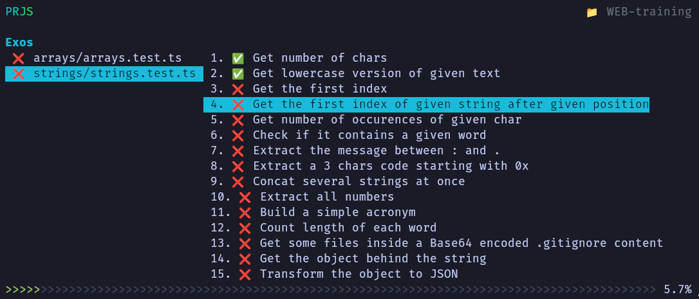
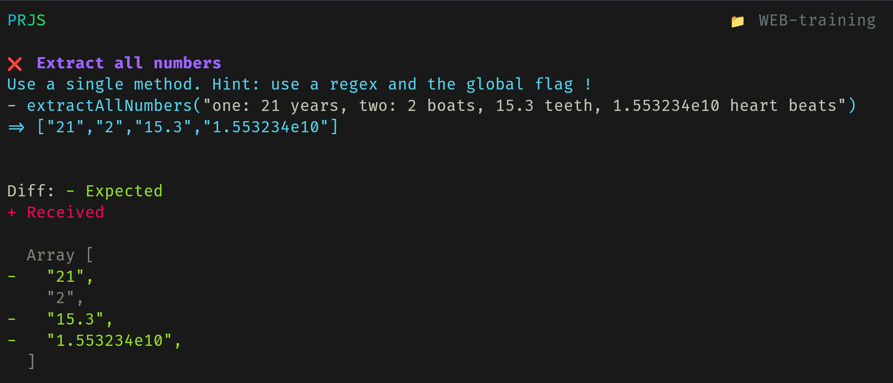
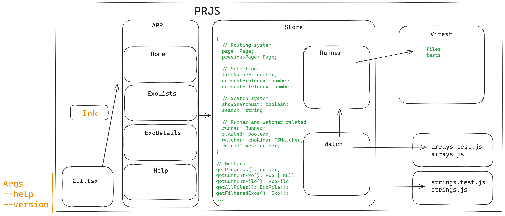

# PRJS - Practice Runner for JavaScript

> Run small JS exos in your terminal with instant feedback loop


## WHY
During the WEB course at HEIG-VD, we trained with various online games or tutorials. The very visual [Flexbox froggy](https://flexboxfroggy.com/), [Elevator Saga](https://play.elevatorsaga.com/) and [TypeScript exercises](https://typescript-exercises.github.io/#exercise=1&file=%2Findex.ts) are just 3 examples of great online websites that let you train a specific part of web development. For HTML and CSS, this is probably a pretty good experience level, but for JavaScript and TypeScript, the online editors clearly lacks the power of local IDEs such as VSCode. When there is no "fast running" test suites backing the exercises, it becomes harder to develop it. Some of those websites focus on learning almost all possible attributes but only half of them are used very most of times.
Let's take another example, the [w3resource.com JavaScript array exercises](https://www.w3resource.com/javascript-exercises/javascript-array-exercises.php), the idea of "Write a function that does X, here is some input and output examples" is good in itself, it allows to train a small concept, a few methods. But manually creating a new function, running it, printing and checking the output by hand is slow and brings a tons of friction.

We had the opportunity to work on our own idea for the latest WEB lab on condition of working with React and 2 other web technologies. We picked Ink (that uses React components) and TypeScript. Instead of doing "just another lab" without any long term utility, this was a great occasion to contribute to the course and contribute to redefine the training experience - in a more deliberate way.

The experience consists of having a way to focus on one exo after the other, show the only the related errors and a rich diff on the result, everything in watch mode reloading on file save, without leaving the comfort of our prefered IDE.

**PRJS would allow to create a set of exos focused on practicing one or more concepts/functions/methods each time. It would make it easy to train on combination of various concepts to increase the level of complexity gradually.**

Exos are written and ran by [Vitest](https://vitest.dev) under the hood. Vitest itself is very powerful for software test suite but not very adapted to exo test suite like we want here. The main problems are that the full test list is displayed all time, all errors are displayed in a big list, when one exo pass, it continues to fail (the next test actually) because there is no transition of "okay it's correct, let's switch to the next exo". There is no way to show more than a title for the exo, making it impossible to directly support hints, instruction, level, ... All these problems make it very hard to focus on a single exo with all this noise around. But the watch mode of Vitest and the nice diff report is very good, this is why PRJS uses Vitest in the background and read its state when there are changes.

This project is inspired by [Rustlings](https://rustlings.cool/) that let you learn Rust and get used to compiler errors with small exos to implement or fix.

Note: This repository do not contains exos, it only contains the runner. The repository [samuelroland/WEB-training](https://github.com/samuelroland/WEB-training) is where we tried to create some exos on array and string manipulations.

<!-- ## Goal
Implémenter une TUI (Text User Interface - CLI en plein écran) pour faciliter l'exécution d'exercices de code avec feedback riche et instantané. Les exos seraient mis à disposition dans un repository Git.

Le projet consisterait à:
1. permettre de parcourir (recherche, filtre, sélection) des exos dans les différents sujets/compétences
1. afficher les exos l'un après l'autre, relancer le test associé à chaque sauvegarde du fichier (watch mode), afficher la raison d'un fail, inclure des indices, afficher un succès et automatiquement passer au suivant après 1s
1. définir une structure/abstraction pour écrire le plus facilement possible des nouveaux exos et leurs tests associés (choisir une structure de donnée adaptée)

Les avantages:
1. Développer un outil qui rend l'expérience de pratique du cours de WEB tellement simple qu'on ne pourrait plus s'en passer
1. Découvrir un outil ([Ink](https://term.ink)) pour faire des TUI en JS (qui utilise des composants React pour gérer la mise en page)
1. Pratiquer TypeScript et React, et découvrir ce qui est possible de faire avec un framework de TUI -->




## Setup

### Installation

```sh
git clone git@github.com:samuelroland/prjs.git
cd prjs
npm install
npm run build
npm install --global .
```
*You might need to run the last command as `sudo`.*

You should now be able to call
```sh
prjs
```

If the command is still not found, try reloading your terminal or make sure the global bin folder is in your PATH...

If you type `?` or you run `prjs -h` you can get the list of shortcuts
```
PRJS - Practice Runner for JavaScript
Run small JS exos in your terminal with instant feedback

Usage
$ prjs

Options
-v, --version: Show version
-h, --help: Show this help


Home Shortcuts
l View list page

List Shortcuts
escape Escape search bar
return Enter a selected exo
return Validate search
j Next item
k Previous item
h Switch to files list
l Switch to exos list
f Find exo by title

Help Shortcuts
escape Escape help page

Train Shortcuts
escape Escape exo details
n Next exo
p Previous exo

All Shortcuts
? View help page
q, ctrl+c Quit the TUI
```

Here is an example repository where you can try it
```sh
git clone https://github.com/samuelroland/WEB-training
cd WEB-training
npm i
prjs
```
<!-- Note: for some unknown reason, Vitest ^1.6.0 need to be installed in the training repository too... not sure actually... -->

### Known issues
1. The watch mode is not perfect, sometimes you need to hit Ctrl+S twice before seeing the current result/exo error.
1. If you have the message `No test found in this folder...`, because the start process is not very stable (and we don't understand why yet), here what you can try
	1. Make sure you are in the WEB-training repository, not the repository of PRJS
	1. Try to save one of the exos files (`arrays/arrays.js` for ex.), so the watch mode will rerun tests wake up
	1. Try typing `j` and `k` a few times, it sometimes helps
1. If you already started to implement the functions, make sure you don't have an infinite loop or a syntax error, because we don't support displaying them yet.


### Update
If you need to update PRJS because it was changed just run
```bash
git pull
npm run build
```

### Development
In addition to the global installation documented above, you need to enable a continuous build to make sure Typescript files and React components are built and updated in the `dist` folder at each code change. Just run this command:
```bash
npm run dev
```

## About
### Extensions
We use the following Ink extensions
1. [fullscreen-ink](https://github.com/DaniGuardiola/fullscreen-ink): let us show the TUI in full screen and restore the context after
1. [gradient-ink]: to easily show gradients on texts
1. TODO: finish this list

### Project status
The goal is to finish all these todos during the holidays of summer 2024 to make PRJS really stable and ready for the next semester.

### Project history
- `22.05.2024` -> `12.06.2024`: a group of 3 students: [@samuelroland](https://github.com/samuelroland), [@CamilleKoestli](https://github.com/CamilleKoestli) and [@GuilhermePintodac](https://github.com/GuilhermePintodac) developed the original version for a WEB course lab. They released and presented the project on the last day. See `presentation` folder for more details. [See project at commit 364366f905b61449da6a1bc5f8744a02037337e4](https://github.com/samuelroland/prjs/tree/364366f905b61449da6a1bc5f8744a02037337e4)
- `18.06.2024`: reupload of the private repository publicly on GitHub under `samuelroland/prjs`, to develop further changes in preparation of the WEB exam on the 21.06.2024. The project is in waiting of school approval to release it under a Free license. We might move the repository on Codeberg at the same time if it makes sense. The project might be used the next semester (S2 2024) by our teacher.

## Todos
Still to attribute/think about:
- [ ] Fix strange alignement in exos list
- [ ] Refactor list duplication in ExosList with StoreList component (see TODO in ExosList)
- [ ] Show Vitest errors and exceptions
- [x] Fix loading time of vitest showing "no file found" instead of something like "loading"
- [x] Hard: Transfer exo metadata from Vitest tests to include instruction, hints and more
- [ ] !! Implements hints (when exo metadata works)
- [x] !! Show arguments of function calls as an easy way to understand what the function should do (when exo metadata works)
- [ ] Group all constants and magic values (like colors in hexa) in util.ts
- [ ] Teacher: How to easily provide the helper.ts abstraction (commited in web-training currently) ?
- [ ] Support running exos in both TS and JS files
- [ ] Automatically open exo file in VSCode ?
- [ ] Enable going up and down if help page is long ??
- [ ] Fix shortcuts matching issues with shift and ?
- [ ] BUG: need 2 Ctrl+S until it refreshes...
- [ ] BUG: no reload ofljkjkk test when changing the exo itself (worse that with the tested function)
- [ ] BUG: often sees "no test in this folder" after tapping 'l' or when Vitest crashes or is in infinite loop...
- [ ] BUG: rendering several times the help page reinsert the 'all' section each time
- [ ] !! Print code and syntax errors to avoid having a blank list of exos
- [ ] !! Print the solution code when exo is done ? How and where to read this solution ?
- [ ] Support basic Markdown in instruction ??
- [ ] Show which test case has created the error (ex: if we have a suite of boolean tests, if it is wrong we have no idea which test case actually failed...)
- [ ] Support adding more metadata about tests suite like a better name that the test file name, eventually the folder.
- [ ] Add level number ? From 1-5 to easily identify very easy and hard exos.
- [ ] Do not allow undefined expected value in helper.ts, do not show obtained vs expected
- [ ] Setup a debug view to easily see Vitest outputs and logs inside PRJS
- [ ] Add a way to export all these logs to ease the debug process
- [ ] Do not pollute user directory with temp files like out.tmp

Camille:
- [x] !! Filter exos with a live text input
- [x] !! Switch to next exo with 'n' and to previous with 'p' in exo page
- [x] Show errors and state of an exo
- [x] !! Improve diffing and errors output

Guilherme:
- [x] Organise shortcuts on help page by categories (separate by page (see Shortcut.pages): all, help, list, then exo specifics)
- [x] Show dynamically generated help page
- [x] Show progress bar at the bottom (use flex align items flex-end and direction column)
- [x] !! Fix progress bar hard coded counter with correct total calculation (in store)

Samuel:
- [x] Open a real exo
- [x] Properly quit TUI (quit vitest, clean temp files, ...)
- [x] Show home page like Vim ? -> include ascii art, TUI version, basic shortcuts like help + tagline ...
- [x] Show real version number in Home page
- [x] Automatic reload of files and exos when vitest runs
- [x] Show a list of files and exos from Vitest
- [x] Should we rename page namings ?
- [x] Translate above text in English
- [ ] Support showing typescript compiler errors ?
- [ ] Refactor colors assignation with some constants in utils.ts
- [x] Refactor and enhance the store
- [x] Refactor the "abstracted" list structure in store ??
- [ ] Document how to easily write and tests exos and how to publish solutions
- [ ] Support only expectation callback in exo() helper without anything else

## How to create exos
1. `npm install vitest` in your repository
1. Create a new test suite in a `*.test.ts` file: Look at https://github.com/samuelroland/WEB-training/blob/main/strings/strings.test.ts as an example
1. You need to copy paste this helper in your repository https://github.com/samuelroland/WEB-training/blob/main/helper.ts
1. and then you'll be able to import the `exo()` function that let's you declare exo declaratively and with some metadata

TODO: document this in a clearer way

**Note: this is a temporary workaround, you shouldn't need to copy paste helper.ts in the future...**

## Development documentation

**The logo**
This is a gradient of an ASCII ART. This was generated with the help of [Calligraphy](https://calligraphy.geopjr.dev/) with the font `Blocky`. The gradient is shown with ink-gradient and consists of these 2 colors: `#1ABADB`, `#18E258` applied to this text piece:

```
████████  ████████        ██  ██████  
██     ██ ██     ██       ██ ██    ██ 
██     ██ ██     ██       ██ ██       
████████  ████████        ██  ██████  
██        ██   ██   ██    ██       ██ 
██        ██    ██  ██    ██ ██    ██ 
██        ██     ██  ██████   ██████  
```

**Further development**
As the goal is to use this tool for the WEB course, it might be improved with the following improvments:
- Publish it on a public Git repository
- Release it under a Free software license
- All the todos above
- Make it more stable

**Architecture**



TODO: document how the project is structured, refactor components and duplications, add unit tests.

## Presentation
You can see our slides for the lab release in [`presentation`](presentation/README.md)


## Contribution
This project is not opened to contributions until we can get the approval of the school to apply a free license on it. But you can contribute to the exos repository [samuelroland/WEB-training](https://github.com/samuelroland/WEB-training) !