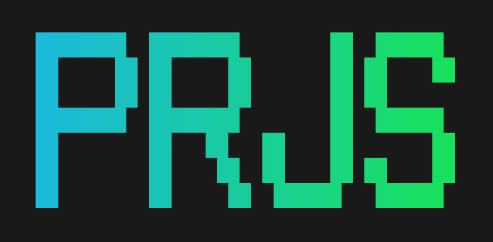

# PRJS - Practice Runner for JavaScript

> Run small JS exos in your terminal with instant feedback loop



TODO: include a nice GIF !

[todos](todos.md) - [dev docs](dev.md)

## WHY
During the WEB course at HEIG-VD, we trained with various online games or tutorials. The very visual [Flexbox froggy](https://flexboxfroggy.com/), [Elevator Saga](https://play.elevatorsaga.com/) and [TypeScript exercises](https://typescript-exercises.github.io/#exercise=1&file=%2Findex.ts) are just 3 examples of great online websites that let you train a specific part of web development. For HTML and CSS, this is probably a pretty good experience level, but for JavaScript and TypeScript, the online editors clearly lacks the power of local IDEs such as VSCode. When there is no "fast running" test suites backing the exercises, it becomes harder to develop it. Some of those websites focus on learning almost all possible attributes but only half of them are used very most of times.
Let's take another example, the [w3resource.com JavaScript array exercises](https://www.w3resource.com/javascript-exercises/javascript-array-exercises.php), the idea of "Write a function that does X, here is some input and output examples" is good in itself, it allows to train a small concept, a few methods. But manually creating a new function, running it, printing and checking the output by hand is slow and brings a tons of friction.

We had the opportunity to work on our own idea for the latest WEB lab on condition of working with React and 2 other web technologies. We picked Ink (that uses React components) and TypeScript. Instead of doing "just another lab" without any long term utility, this was a great occasion to contribute to the course and contribute to redefine the training experience - in a more deliberate way.

The experience consists of having a way to focus on one exo after the other, show the only the related errors and a rich diff on the result, everything in watch mode reloading on file save, without leaving the comfort of our prefered IDE.

**PRJS would allow to create a set of exos focused on practicing one or more concepts/functions/methods each time. It would make it easy to train on combination of various concepts to increase the level of complexity gradually.**

Exos are written and ran by [Vitest](https://vitest.dev) under the hood. Vitest itself is very powerful for software test suite but not very adapted to exo test suite like we want here. The main problems are that the full test list is displayed all time, all errors are displayed in a big list, when one exo pass, it continues to fail (the next test actually) because there is no transition of "okay it's correct, let's switch to the next exo". There is no way to show more than a title for the exo, making it impossible to directly support hints, instruction, level, ... All these problems make it very hard to focus on a single exo with all this noise around. But the watch mode of Vitest and the nice diff report is very good, this is why PRJS uses Vitest in the background and read its state when there are changes.

This project is inspired by [Rustlings](https://rustlings.cool/) that let you learn Rust and get used to compiler errors with small exos to implement or fix.

Note: This repository do not contains exos, it only contains the runner. The repository [samuelroland/WEB-training](https://github.com/samuelroland/WEB-training) is where we tried to create some exos on array and string manipulations.

TODO: update this !


## Help

You can run `prjs -h` you can get the list CLI flags and TUI shortcuts. You can also access the shortcuts by typing `?` when PRJS is started.
```
PRJS - Practice Runner for JavaScript
Run small JS exos in your terminal with instant feedback

Usage
$ prjs

Options
-v, --version: Show version
-h, --help: Show this help
-d, --debug: Enable debug mode

Common shortcuts
? View help page
q, Ctrl+c Quit the TUI

Help shortcuts
escape Escape help page
j, down Scroll down
k, up Scroll up

Home shortcuts
l View list page

List shortcuts
escape Escape search bar
return Enter a selected exo
return Validate search
j, down Next item
k, up Previous item
h, left Switch to files list
l, right Switch to exos list
f Find exo by title

Train shortcuts
escape Escape exo details
n Next exo
p Previous exo
```

TODO: sort this

Here is an example repository where you can try it
```sh
git clone https://github.com/samuelroland/WEB-training
cd WEB-training
npm i
npx prjs
```

### Known issues
1. The watch mode is not perfect, sometimes you need to hit Ctrl+S twice before seeing the current result/exo error.
1. If you have the message `No test found in this folder...`, because the start process is not very stable (and we don't understand why yet), here what you can try
	1. Make sure you are in the WEB-training repository, not the repository of PRJS
	1. Try to save one of the exos files (`arrays/arrays.js` for ex.), so the watch mode will rerun tests wake up
	1. Try typing `j` and `k` a few times, it sometimes helps
1. If you already started to implement the functions, make sure you don't have an infinite loop or a syntax error, because we don't support displaying them yet.

**Debug mode**
If PRJS is not working as expected, you can run in debug mode with `-d` or `--debug` and look at logs generated in the same folder as `debug.log`, `out.log` and `err.log`... You can see the progress of logs with `tail` like `tail -f debug.log`. The first file is logged generated by PRJS debug code and the 2 following are stdout and stderr of the Vitest instance programmatically started by PRJS.

## Recommended usage
In your exos repository, I recommend to

## Install from source
### Update
If you need to update PRJS because it was changed just run
```bash
git pull
pnpm build
```

### Development
In addition to the global installation documented above, you need to enable a continuous build to make sure Typescript files and React components are built and updated in the `dist` folder at each code change. Just run this command:
```bash
pnpm dev
```

## How to create exos
Let's say we want to create exos on Array manipulation. We are going to define a list of functions to create and some tests associated with each function. We are going to give a title and possibly an instruction to explain what is should do in addition to shown tests.

1. Create a folder `arrays`
1. Create a file `arrays/arrays.js` with one exported function per exo. Students will modify this file to implement the exos.
    ```js
    // Learn array manipulations, run these exos with PRJS
    export function getEmptyArray() {
      //TODO
    }
    export function pushAndRemove(array, pushTimes, pushValue, popFrontTimes) {
      //TODO
    }
    ```
1. Create a file `arrays/arrays.test.ts` (or .js as you want) with at least these 2 imports. The first is to get the `exo()` abstraction from PRJS and the second is to import all exported functions inside `arrays.js` to refer them when redacting exos.
    ```js
    import { exo } from 'prjs';
    import * as fns from './arrays.js';
    ```
1. You can now declare some exos declaratively like this:
    ```js
    exo({
      title: 'Create an empty array',
      fn: fns.getEmptyArray,
      tests: [{ expected: [] }],
    });

    exo({
      title: 'Push back values and remove at front',
      instruction: "Here, we want to push 4 times '10' and pop front 2 times",
      fn: fns.pushAndRemove,
      tests: [
        { args: [[1, 2, 3], 4, 10, 2], expected: [3, 10, 10, 10, 10], },
        { args: [[1, 2, 3], 1, 2, 5], expected: [], },
      ],
    });
    ```
1. As you can see above, we are just giving a title, a reference to a function and a list of tests. This enables to define some metadata that are not possible to indicate when writing Vitest tests (just name + function) and it is faster (and maybe more readable) to give some arguments and assert equality on some expected returned value instead of writing a lot of `expect(pushAndRemove([1, 2, 3], 4, 10, 2).to.deep.equal([3, 10, 10, 10, 10])`

TODO: continue with expect and async !

## About
### Extensions
We use the following Ink extensions
1. [fullscreen-ink](https://github.com/DaniGuardiola/fullscreen-ink): let us show the TUI in full screen and restore the context after
1. [gradient-ink]: to easily show gradients on texts
1. TODO: finish this list

### Project status
The goal is to finish all these todos during the holidays of summer 2024 to make PRJS really stable and ready for the next semester.

### Project history
- `22.05.2024` -> `12.06.2024`: a group of 3 students: [@samuelroland](https://github.com/samuelroland), [@CamilleKoestli](https://github.com/CamilleKoestli) and [@GuilhermePintodac](https://github.com/GuilhermePintodac) developed the original version for a WEB course lab. They released and presented the project on the last day. See `presentation` folder for more details. [See project at commit 364366f905b61449da6a1bc5f8744a02037337e4](https://github.com/samuelroland/prjs/tree/364366f905b61449da6a1bc5f8744a02037337e4)
- `18.06.2024`: reupload of the private repository publicly on GitHub under `samuelroland/prjs`, to develop further changes in preparation of the WEB exam on the 21.06.2024. The project is in waiting of school approval to release it under a Free license. We might move the repository on Codeberg at the same time if it makes sense. The project might be used the next semester (S2 2024) by our teacher.

## Presentation
You can see our slides for the lab release in [`presentation`](presentation/README.md)

## Contribution
This project is not opened to contributions until we can get apply a free software license. But you can contribute to the exos repository [samuelroland/WEB-training](https://github.com/samuelroland/WEB-training) !

## License
All rights reserved for now. All contributors are okay to release it as a free software but we need to wait until we can get the approval of the school as it was developed at school... Coming in September-October 2024 I hope!
