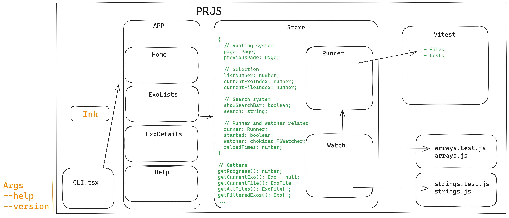

---

### WHY ?


---

### Technologies

1. React
1. TypeScript
1. Ink
1. Zustand

```jsx
<Box width="100%">
	<Text bold>PRJS</Text>
	<TextInput value={search} onChange={a => store.updateSearchFilter(a)} placeholder="Enter a search keyword" onSubmit={() => store.setSearchBarVisibility(false)} />
	<Text backgroundColor="gray">Current folder</Text>
	<Newline></Newline>
</Box>
```

```js
const useStore = create<Store>((set: any) => ({
	page: 'home',
	previousPage: 'home',
	getAllPagesInUppercase() {
		return [this.page, this.previousPage].map(p => p.toUpperCase())
	},
	setPage(page: Page) {
		set((state: Store) => ({page: page, previousPage: state.page}));
	}
)}

const store = useStore();
store.getAllPagesInUppercase()
```

---

### Architecture




---

### Challenges
<v-clicks>

- No hot reload mode in Ink
- Bad errors display
- No easy way to debug other than writing to a file
- Test system
- Watch mode rabbit hole
- zustand `set()` not correctly typed...

</v-clicks>


---

### Watch mode trials

```js
listenForChanges(fn: Function) {
	if (!this.vt) return;
	this.vt?.runningPromise?.then(async () => {
		while (true) {
			if (this.vt?.runningPromise) {
				await this.vt?.runningPromise;
				fn();
				setTimeout(() => this.listenForChanges(fn), 1);
			}
		}
	});
}
```

----
### Watch mode trials - 2

```js
runner: new URL('run.js', import.meta.url).toString(),
```

```js
class ListenRunner extends JsonReporter {
	callme: () => void;
	constructor(callme: () => void) {
		super({})
		this.callme = callme
	}
	override onFinished(_?: File[] | undefined): Promise<void> {
		this.callme()
		return Promise.resolve()
	}
}
```

----

### Watch mode trials - 3

```js
export default class CustomRunner extends VitestTestRunner {
	override onAfterRunFiles(): void {
		useStore.getState().updateExos();
		debug('ran fn()');
	}
}

export default class CustomReporter extends BasicReporter {
	constructor() {
		super();
	}
	override onTaskUpdate(_: TaskResultPack[]): void {
		useStore.getState().updateExos();
		debug('ran fn()');
	}
}
```

---

### Watch mode - working !
```js
const update = async (event: any, path: string) => {
	if (!path.endsWith('.js')) return;
	await this.runner.runAll();
	set({reloadTimes: this.reloadTimes + 1});
};
this.watcher = chokidar.watch('.', {ignored: '.git/**|node_modules/**|.vite/**|**.log|**.tmp'})
	.on('all', update);
```

---

### Debugging


---

### Fun moments
<v-clicks>

- ASCII art
- Live search filter
- Easy to deal with colors and gradient
- A lot of nice plugins
- Native diff from Vitest
- Exo metadata
- Watch mode fast and satisfaying

</v-clicks>

---
layout: center
---

### Demo time !
1. WEB-training repository
1. Exo training

---

### What's next ?
1. Adding hints
1. Publishing a NPM package to easily import helper.ts
1. Fixing a few rendering issues
